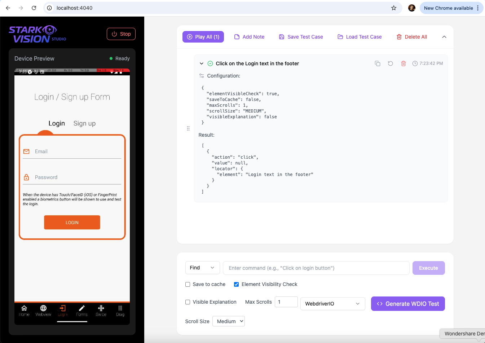

# Stark Vision 🚀

Welcome to **Stark Vision**, the AI-Native mobile test automation framework that transforms mobile app testing! Inspired by the Avengers, Stark Vision allows you to automate mobile tests effortlessly using natural language and advanced AI capabilities.

Explore more: [starkvision.in](https://starkvision.in) 🌐

---

## Table of Contents

1. [Features](#features)
2. [Supported Platforms](#supported-platforms)
3. [Getting Started](#getting-started)
   - [Install Dependencies](#1-install-dependencies)
   - [Running the Server](#2-running-the-server)
   - [Running the Studio](#3-running-the-studio)
   - [Running Test Automation](#4-running-test-automation)
4. [Docker](#Docker)
5. [Cloud Configuration](#cloud-configuration)
6. [Usage Examples](#usage-examples)
7. [Recommendations](#Recommendations)
8. [Contributing](#contributing)
9. [Configuration](#Options-for-Stark-Instructions)
10. [Links & Documentation](#links--documentation)

---

## Features ✨

- **AI-Native Automation** 🤖: Automate mobile apps effortlessly without relying on traditional locators.
- **Natural Language Testing** 📝: Write test cases in simple natural language, and let AI handle the complexities.
- **Native SDK Switching** 🔄: Switch to native SDKs seamlessly for advanced use cases and added flexibility.
- **Vision-Based Testing** 👁️: Perform automation based on visual elements to boost accuracy and efficiency.

---

## Supported Platforms 📱

- **Android** 🤖
- **iOS** 🍏

---

## Getting Started

### 1. Install Dependencies

Ensure you have Node.js installed. Then, install Stark Vision using:

```shell
npm install stark-vision
```

### 1. Running the Appium Server

Start the server with any port number and provide the same port in step 2(Running the Stark Server)

```shell
 appium server -pa /wd/hub
```

### 2. Running the Stark Server

Start the server with:

```shell
stark-vision
```

Stark is looking for appium server to be running in default port 4723, if you start the appium server in custom port in Step 1 then set APPIUM_URL in the environment variable.

_Default port for stark server: 4040. Use `http://localhost:4040/wd/hub` for the Appium WebDriver._

### 3. Running Test Automation

Before you execute tests make sure the appium server url is pointing to `http://localhost:4040/wd/hub`.

---

## Docker

### Pulling and Running the Appium Stark Vision Docker Container

Follow these steps to build and run the Docker container, set up the environment, and connect an ADB device on a Mac:

1. **Build the Docker Image**:

   ```bash
   docker pull atddevs/stark-vision
   ```

2. **Run the Docker Container**:
   Start the container, exposing the necessary ports and setting the `STARK_API_KEY` environment variable:

   ```bash
   docker run -d --name appium-stark-vision-container -p 4723:4723 -p 4040:4040 -e STARK_API_KEY=your_api_key_value atddevs/stark-vision
   ```

3. **Connect the ADB Device Inside the Container for MAC via WIFI**:
   Use the following commands to connect the ADB device and list connected devices:

   - Connect the ADB device:

     ```bash
     docker exec appium-stark-vision-container adb connect 192.168.29.146:5555 //IP address of the android device wifi
     ```

   - List connected ADB devices:
     ```bash
     docker exec appium-stark-vision-container adb devices
     ```

4. **Connect ADB device inside the container for MAC via host**:
   ```
   -e USE_HOST_ADB=true
   ```
   ```bash
   docker run -d --name appium-stark-vision-container -p 4723:4723 -p 4040:4040 -e STARK_API_KEY=your_api_key_value -e USE_HOST_ADB=true atddevs/stark-vision
   ```

Now you’re ready to use the container for test automation with both Appium and Stark Vision services running!

## Playground

### Stark Vision Studio

Welcome to the Stark Vision Studio, your all-in-one command center for seamless mobile test automation. Below is an overview of the powerful features at your disposal.


The main dashboard provides a comprehensive view of your testing environment. You can see the live screen of your connected device, view detailed logs in real-time. The top bar allows you to save and load test cases, and manage your sessions.



inspect the element hierarchy, and view detailed logs in real-time. The top bar allows you to easily switch between different cloud providers and manage your sessions.

## Cloud Configuration

### Starting the Server with Cloud Configuration

Configure Stark Vision to run on cloud platforms like LambdaTest:

```shell
APPIUM_URL=https://lt_username:lt_accessKey@@mobile-hub.lambdatest.com/wd/hub stark-vision
```

_Default port for stark server: 4040. Use `http://localhost:4040/wd/hub` for the Appium WebDriver._

**Sample Cloud Configuration:**

```json
{
  "cloud": {
    "provider": "lambdaTest",
    "url": "https://mobile-hub.lambdatest.com/wd/hub"
  }
}
```


---

## Usage Examples

By default, Stark-Vision doesn't cache anything locally to enhance performance. If you'd like to enable caching for instructions, you can set `vision:saveToCache: true` in your capabilities. This will allow element actions to be retrieved from the cache on subsequent runs.

Here's how to write a simple test in natural language:

#WDIO

```javascript
import { remote } from 'webdriverio';
import { expect } from 'chai';
import fs from 'fs';

const APPIUM_HOST = '127.0.0.1';
const APPIUM_PORT = 4040;
const WDIO_PARAMS = {
  connectionRetryCount: 0,
  hostname: APPIUM_HOST,
  port: APPIUM_PORT,
  path: '/wd/hub/',
  logLevel: 'info',
  waitforTimeout: 10000,
  mochaOpts: {
    timeout: 20000,
  },
};
const iOSCapabilities = {
  platformName: 'iOS',
  'appium:automationName': 'XCUITest',
  'appium:screenshotQuality': 0,
  'appium:webdriverAgentUrl': 'http://127.0.0.1:8100',
};

const androidCapabilties = {
  platformName: 'Android',
  'appium:automationName': 'UIAutomator2',
};

let driver;

describe('Plugin Test', () => {
  beforeEach(async () => {
    const capabilities = androidCapabilties;
    driver = await remote({ ...WDIO_PARAMS, capabilities });
  });

  async function closeKeyBoard() {
    await ai('Click on the down arrow button');
  }

  async function goBack() {
    await ai('Click on the device back button');
  }

  it('Swiggy Test', async () => {
    await ai('Click on search field');
    await ai('Enter "Fresh Menu" into Search text field');
    await ai('Click the FreshMenu restaurant', { saveToCache: false });
    await ai('Scroll up until you see the "Add" text', {
      maxScrolls: 9,
      scrollSize: 'MEDIUM',
    });
    await ai('Click on Add', {
      elementVisibleCheck: false,
      saveToCache: false,
    });
    await ai('Click on Add item');
    await ai('Click on View Cart');
    if (await driver.isAndroid) {
      await ai('Scroll up until you see the Tip', {
        maxScrolls: 5,
        scrollSize: 'SMALL',
      });
    } else {
      await ai('Scroll up until you see the Leave at Door text', {
        maxScrolls: 5,
        scrollSize: 'MEDIUM',
      });
    }
  });

  afterEach(async () => await driver.deleteSession());
});

//WDIO does not throw error that is handled by stark vision.
const ai = async (instruction, options) => {
  const res = await driver.execute('vision: findByAI', {
    instruction,
    options,
  });
  if (res.error) {
    throw new Error(JSON.stringify(res));
  }
  return res;
};

const aiGetInfo = async (instruction) => {
  await driver.pause(2000);
  return await driver.execute('vision: getInfo', {
    instruction,
  });
};
```

JAVA

```java
package com.atd.test;

import io.appium.java_client.AppiumDriver;
import io.appium.java_client.android.AndroidDriver;
import io.appium.java_client.android.options.UiAutomator2Options;
import org.testng.annotations.AfterClass;
import org.testng.annotations.BeforeClass;
import org.testng.annotations.Test;

import com.fasterxml.jackson.databind.ObjectMapper;
import com.fasterxml.jackson.core.type.TypeReference;
import com.fasterxml.jackson.core.JsonProcessingException;

import java.net.MalformedURLException;
import java.net.URL;
import java.time.Duration;
import java.util.HashMap;
import java.util.Map;

public class SampleTest {
    public AppiumDriver driver;
    private final ObjectMapper mapper = new ObjectMapper();

    @BeforeClass
    public void setUp() throws MalformedURLException {
        // iOSDriverCreation();
        UiAutomator2Options options = new UiAutomator2Options();
        options.setNewCommandTimeout(Duration.ofSeconds(700000));
        options.setAutomationName("UIAutomator2");
        driver = new AndroidDriver(new URL("http://127.0.0.1:4040/wd/hub"), options);
    }

    @Test
    public void testWithSwipeAndAssertions() throws JsonProcessingException {
        ai("Scroll up until you see 'Made in India'", 5);
        ai("Scroll down until you see 'Address List'", 5, "SMALL");
        ai("Click on 'Where are you going?'");
        ai("Enter for 'HSR Layout' in the Drop location field");
        ai("Click on the 'Heart icon of HSR Layout Polic Station below Select on Map'");
        AIResponse response = getAIResponse("Can you see 'HSR Layout Polic Station below Add to favourites'?");
        System.out.println("Condition Satisfied: " + response.isConditionSatisfied());
        System.out.println("Explanation: " + response.getExplanation());
        ai("Click on the device back button");
        ai("Click on 'HSR Layout below Select on Map'");
        ai("Scroll up from \"Vehicle scrollable view\" until you see the \"Auto Pet\" text");
    }


    /**
     * Gets AI information and parses the response
     *
     * @param instruction The instruction to send to AI
     * @return AIResponse containing the parsed response
     * @throws JsonProcessingException if JSON parsing fails
     */
    protected AIResponse getAIResponse(String instruction) throws JsonProcessingException {
        String result = (String) aiGetInfo(instruction);
        Map<String, Object> jsonMap = mapper.readValue(result, new TypeReference<Map<String, Object>>() {
        });

        boolean conditionSatisfied = (Boolean) jsonMap.get("conditionSatisfied");
        String explanation = (String) jsonMap.get("explanation");

        return new AIResponse(conditionSatisfied, explanation);
    }

    private Object ai(String instruction) {
        return ai(instruction, null, null, null, null);
    }

    private Object ai(String instruction, int maxScrolls) {
        return ai(instruction, null, null, maxScrolls, null);
    }

    private Object ai(String instruction, int maxScrolls, String scrollSize) {
        return ai(instruction, null, null, maxScrolls, scrollSize);
    }

    private Object ai(String instruction, Boolean saveToCache, Boolean elementVisibleCheck, Integer maxScrolls, String scrollSize) {
        // Set default values for optional parameters
        if (saveToCache == null) {
            saveToCache = false; // Default value
        }
        if (elementVisibleCheck == null) {
            elementVisibleCheck = true; // Default value
        }
        if (maxScrolls == null) {
            maxScrolls = 3; // Default value
        }
        if (scrollSize == null) {
            scrollSize = "SMALL"; // Default value
        }

        Map<String, Object> args = new HashMap<>();
        args.put("instruction", instruction);

        // Options map with parameters
        Map<String, Object> options = new HashMap<>();
        options.put("saveToCache", saveToCache);
        options.put("elementVisibleCheck", elementVisibleCheck);
        options.put("maxScrolls", maxScrolls);
        options.put("scrollSize", scrollSize);

        // Add options to args
        args.put("options", options);

        // Execute the Appium script
        return driver.executeScript("vision: findByAI", args);
    }

    private Object aiGetInfo(String instruction) {
        Map<String, Object> args = new HashMap<>();
        args.put("instruction", instruction);
        return driver.executeScript("vision: getInfo", args);
    }

    @AfterClass
    public void tearDown() {
        driver.quit();
    }
}

package com.atd.test;

public class AIResponse {
    private final boolean conditionSatisfied;
    private final String explanation;

    public AIResponse(boolean conditionSatisfied, String explanation) {
        this.conditionSatisfied = conditionSatisfied;
        this.explanation = explanation;
    }

    public boolean isConditionSatisfied() {
        return conditionSatisfied;
    }

    public String getExplanation() {
        return explanation;
    }

    @Override
    public String toString() {
        return "AIResponse{" +
                "conditionSatisfied=" + conditionSatisfied +
                ", explanation='" + explanation + '\'' +
                '}';
    }
}

```

How to add assertions to the test?
WDIO

```javascript
const aiGetInfo = async (instruction) => {
  await driver.pause(2000);
  return await driver.execute("vision: getInfo", {
    instruction,
  });
};

aiGetInfo('Can you see "HSR Layout below Favourties?")
Output:
{
conditionSatisfied: true,
explanation: Yes, 'HSR Layout' appears directly below the 'Add to favourites' heading, followed by 'Bengaluru, Karnataka, India' as the address.
}
If instruction is not found then the output would look like
{
conditionSatisfied: false,
explanation: There is no 'HSR Layout' text directly below 'Add to favourites'. The image shows 'Add to favourites' at the bottom of a list of HSR Layout locations, but below that is just a keyboard interface for English (India)..
}
```

## Recommendations

1. Stark-Vision doesn’t cache data locally by default to optimize performance. To enable caching for future runs, set the capability `vision:saveToCache: true`.
2. For any scroll instruction, such as `await ai('Scroll up until you see the "Add" text')`, you can skip checking if the element is visible, as the prior instruction already performs this check.
3. Any instruction that follows a scroll action should have `saveToCache: false` if caching is enabled in the capabilities.

## Options for Stark Instructions

### Element Visibility Check

- **Option**: `{ elementVisibleCheck: false }`
- **Description**: This option determines whether Stark should check if the element is visible before performing an action on it. When set to `false`, Stark will attempt to interact with the element regardless of its visibility state. This can be useful in scenarios where the element is already present, like a form; you wait for the first element but don't want to wait for other elements.
- **Usage**:
  ```javascript
  await ai('Click on the button', { elementVisibleCheck: false });
  ```

### Save to Cache

- **Option**: `{ saveToCache: false }`
- **Description**: This option specifies whether the result of Stark's action should be cached for later use. Setting it to `false` means that the action will not be cached, which can be useful when you want to ensure that fresh data is retrieved each time the action is performed. This is particularly relevant in cases where the state of the application may change frequently, and you want to avoid relying on potentially outdated cached results.
- **Usage**:
  ```javascript
  await ai('Fetch current data', { saveToCache: false });
  ```

### Scrolling Options

- **Option**: `{ maxScrolls: 5, scrollSize: 'SMALL' }`
- **Description**: These options control the scrolling behavior of Stark when it needs to find an element that is not currently in view.
  - **maxScrolls**: This defines the maximum number of scroll attempts Stark will make to find the desired element. In this case, Stark will scroll up to 5 times before giving up.
  - **scrollSize**: This specifies the size of each scroll action. A setting of `'SMALL'` indicates that Stark will scroll a small distance each time, allowing for finer control when searching for elements.
- **Usage**:
  ```javascript
  await ai('Scroll until you find the "Next" button', {
    maxScrolls: 5,
    scrollSize: 'SMALL',
  });
  ```

---

_For more detailed examples and edge cases, visit our documentation._

## Links & Documentation

- **Official Website**: [starkvision.in](https://starkvision.in)
- **API Reference**: [API Docs](link-to-api-docs)
- **Detailed Documentation**: [Docs](link-to-detailed-docs)
- **Community Support**: [Discussion Forum](link-to-community-forum)

---
